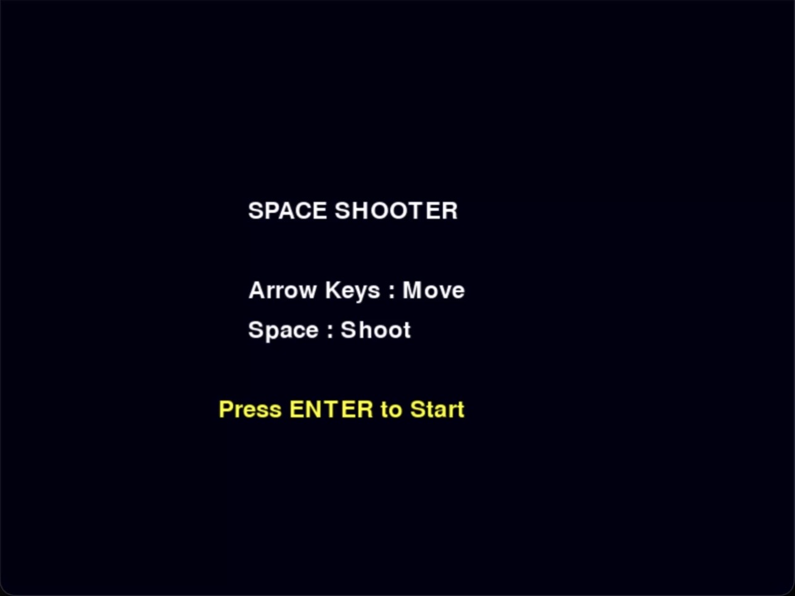
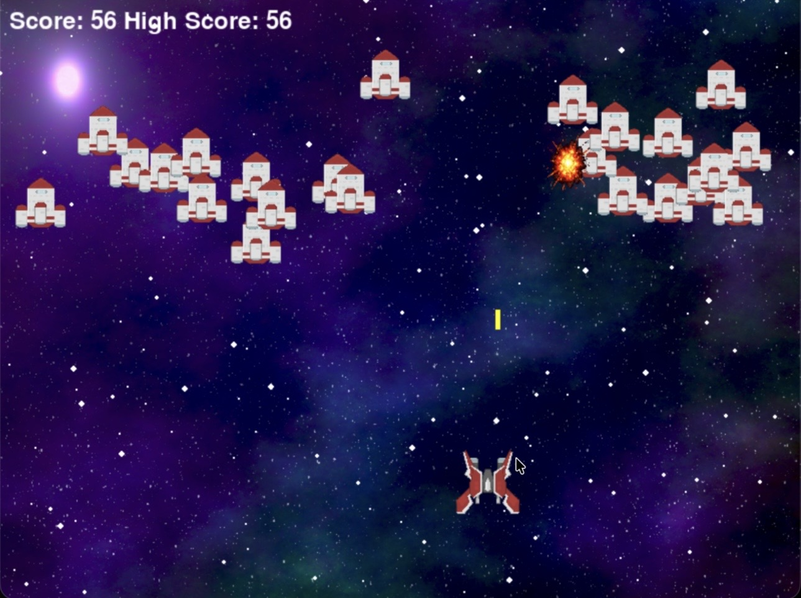
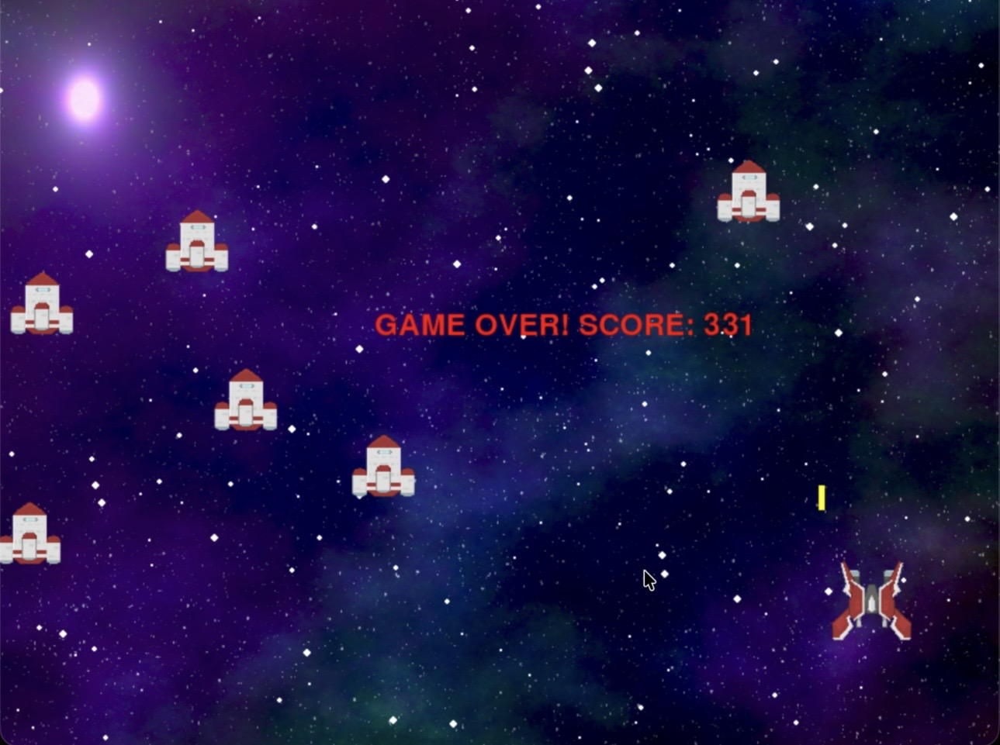

# 🚀 Space Shooter Game

A classic arcade-style Space Shooter game built using Python and Pygame.

##  Features

- Player spaceship movement
- Enemy spaceship movement
- Shooting mechanics
- Collision detection
- Explosion animation
- Explosion sound effects
- Background space music
- Dynamic difficulty scaling
- Twinkling star background
- Start screen
- High score system
- Pause functionality

##  Technologies Used

- Python
- Pygame

##  Controls

| Key | Action |
|-----|---------|
| ← → | Move spaceship |
| Space | Shoot |
| P | Pause / Resume |
| Enter | Start Game |

## Project Structure

```text
space-shooter-pygame/
│
├── images/
├── sounds/
├── main.py
├── requirements.txt
└── README.md
```

## Installation

```bash
pip install pygame
python main.py
```

## Future Improvements

- Boss fights
- Power-ups
- Multiple levels
- Enemy bullets
- Health bar
- Leaderboard

## 📸 Gameplay Screenshots

### Gameplay


### Explosion


### Game Over


---

Developed by **Hriday Arora**
